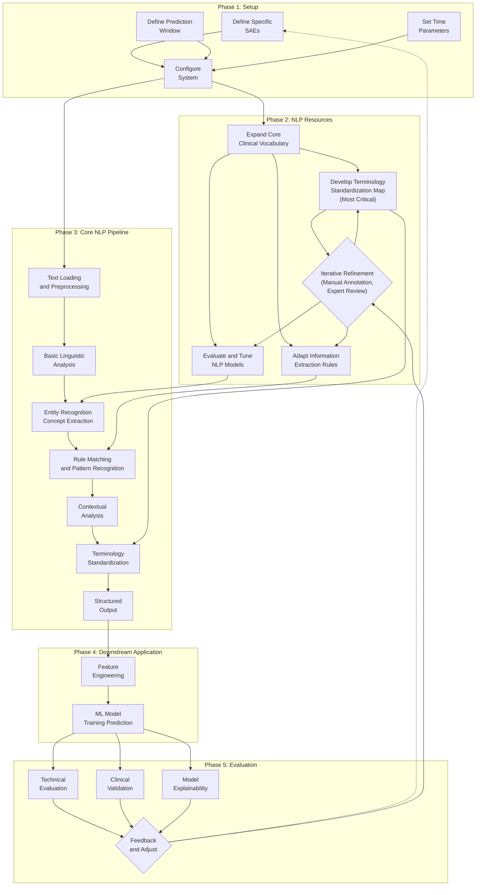

# Clinical Natural Language Processing Pipeline: Predicting Serious Adverse Events (SAEs)

This repository contains a Python-based pipeline framework designed for analyzing patient clinical text records and other available data. It leverages Natural Language Processing (NLP) and Machine Learning (ML) techniques to process this information, identify potential risk factors, and ultimately predict the likelihood of a patient experiencing a specific **Serious Adverse Event (SAE)** within a predefined future time window.

---

## Pipeline Core: Processing Clinical Text Information

The framework's ability to effectively utilize clinical note information lies in its powerful **Clinical Natural Language Processing (NLP) Pipeline**. This pipeline processes text through a series of structured steps to extract and structure relevant clinical information, as illustrated below:

**Note:** The core text processing logic is encapsulated within **Phase 3** of the diagram above. This involves loading and cleaning text, performing linguistic analysis (like tokenization), recognizing key clinical concepts (entities), applying rules, understanding context (like negation), standardizing terminology using resources built in Phase 2, and finally outputting structured data for downstream use.

**Crucially, the success of this entire pipeline, especially Phase 3, hinges on the quality of the resources built in Phase 2. This resource building step is the most vital and labor-intensive part of adapting the framework for real-world clinical applications.**

---

## Adapting to Real Clinical Application: A Practical Guide

To successfully apply this framework to real-world clinical SAE prediction tasks, it is **essential and critical** to fully configure and customize the pipeline components and downstream models using accurate, domain-specific knowledge tailored to the particular clinical scenario, as outlined in the phases below.

---

> ⚠️ Important Note: On the Limitations of the Demo Code
> 
> 
> The code configuration provided in this repository is **for demonstration purposes only** and has been **intentionally oversimplified**. It is **not clinically relevant** and **will not** produce clinically meaningful or reliable predictive results on real clinical data.
> 
> Therefore, to transition this framework from a demo to a **potentially usable clinical prediction system**, it **must** be led by professionals with relevant domain expertise (such as clinicians, pharmacists, clinical researchers, medical informaticists, medical information engineers, etc.). They must conduct a **thorough, in-depth modification and extension** of the configuration files (specifically `src/config.py`, etc.) based on the actual research goals and data characteristics.
> 

---

Here are the key areas and steps for adapting to real applications, corresponding to the phases in the workflow diagram:

### Phase 1: Precisely Define the Clinical Problem and Setup

*(Corresponds to Phase 1 in the diagram)*

This initial setup phase involves clearly defining the scope and parameters of the prediction task.

- **Specific SAEs:** Clearly and unambiguously define the **specific** serious adverse events you are attempting to predict. Strictly delineate and code these outcome events based on authoritative clinical standards (e.g., a specific grade within CTCAE, a particular combination of diagnosis codes, or a predefined clinical event).
- **Prediction Window:** Determine a prediction time window (`OUTCOME_WINDOW_DAYS` in `src/config.py`) that is both clinically relevant and feasible. This requires considering the mechanism of occurrence of the target SAE, the duration of relevant treatment regimens, and the intervals and timeliness of clinical monitoring.
- **Time Parameters:** Based on clinical understanding, reasonably set time-related parameters such as the lookback window (`LOOKBACK_DAYS` in `src/config.py`, the time range model reviews patient history) and the recent window (`RECENT_WINDOW_DAYS` in `src/config.py`, used to differentiate recent and distant information). This helps in constructing clinically meaningful time-series features.
- **System Configuration:** Ensure general system settings and file paths in `src/config.py` are correctly configured for your environment.

### Phase 2: Build High-Quality Clinical NLP Resources (Critical & Iterative)

*(Corresponds to Phase 2 in the diagram - **The Most Critical and Time-Consuming Phase**)*

This phase focuses on creating the domain-specific knowledge bases required for the NLP pipeline (Phase 3) to understand clinical text accurately. The quality of these resources directly determines the pipeline's performance. This often involves significant manual effort, clinical expertise, and iteration.

- **Expand Core Clinical Vocabulary:** Build a comprehensive list of all relevant clinical concepts to serve as a foundational vocabulary, including:
    - Target SAEs and their associated manifestations (consider defining in `AES` list in `src/config.py`)
    - Relevant medications (study drugs, concomitant medications, etc.; consider defining in `DRUGS` list in `src/config.py`)
    - Relevant comorbidities, past medical history, procedures, laboratory tests, physical exam findings, etc. (depending on your specific prediction task)
- **【Most Critical Task】Develop a Robust Terminology Standardization Mapping Table:** This is the **bottleneck and most challenging task**, requiring deep analysis of your specific clinical text data.
    - You must analyze a large sample of clinical notes to identify **all** the different ways clinicians refer to concepts from your core vocabulary. This includes: common clinical abbreviations, hospital or department-specific jargon, synonyms or near-synonyms, different levels of detail in descriptions, colloquial expressions, and even common spelling or typing errors.
    - Then, build a **precise mapping table** between these text variations and your standardized clinical terms (populate the `AE_NORMALIZATION_MAP` dictionary in `src/config.py` extensively based on your findings).
    - This process requires **extensive manual annotation, clinical expert review, and continuous iterative refinement**. The **completeness and accuracy** of this mapping table directly determine the coverage and precision of information extraction in Phase 3.
- **Adapt Information Extraction Rules:**
    - Customize or write rules for extracting specific details (e.g., medication dosage, frequency, duration, symptom severity grading, time point information) to accurately match the linguistic patterns and documentation practices in your notes.
    - Define severity terms and map them to grades (review/expand `SEVERITY_TERMS` and `SEVERITY_PATTERNS` in `src/config.py`).
- **Evaluate and Tune NLP Models:**
    - The underlying NLP models (defined by `NLP_MODEL_NAME` in `src/config.py`) may have limited effectiveness on highly specific clinical terminology.
    - Evaluate their performance in identifying key entities (defined by `AE_LABELS`, `DRUG_LABELS` in `src/config.py`) on your data.
    - Consider adjusting the labeling scheme or potentially fine-tuning the models on annotated data if necessary.

### Phase 3: Core NLP Processing Pipeline Application

*(Corresponds to Phase 3 in the diagram)*

Once the resources from Phase 2 are adequately prepared, this phase applies the core NLP pipeline (implemented in scripts like `src/nlp_extraction.py`) to process the clinical text using those resources. This involves steps like text loading, linguistic analysis, entity/concept extraction, rule matching, contextual analysis (e.g., negation detection using libraries like `negspacy`), terminology standardization (using `AE_NORMALIZATION_MAP`, etc.), and finally generating structured output. The details of these steps are handled by the pipeline code itself, relying heavily on the configurations and resources built in Phase 1 and Phase 2.

### Phase 4: Downstream Application (Feature Engineering & Modeling)

*(Corresponds to Phase 4 in the diagram)*

The structured data output from Phase 3 is used for subsequent machine learning tasks (implemented in scripts like `src/feature_engineering.py` and `src/modeling.py`).

- **Feature Engineering:** Convert the extracted and structured clinical information (along with other patient data) into numerical features suitable for machine learning models.
- **ML Model Training / Prediction:** Train predictive models (e.g., using libraries like `lightgbm`) on the engineered features to predict the likelihood of the target SAEs defined in Phase 1.

### Phase 5: Rigorous Evaluation and Clinical Interpretation (Feedback Loop)

*(Corresponds to Phase 5 in the diagram)*

Evaluating the model's performance goes beyond technical metrics and requires clinical validation and interpretation, potentially leading to adjustments in earlier phases.

- **Clinical Validation is Paramount:** Do not rely solely on technical evaluation metrics (such as AUC, F1 score, precision, recall, etc.; calculated in `src/modeling.py`). **Clinical experts must independently review** the model's predictions to assess their medical plausibility and consistency and determine if the predicted high-risk patients indeed exhibit high-risk characteristics from a clinical perspective.
- **Enhance Model Explainability:** Use explainability tools (such as SHAP, LIME, etc.; potentially used in `src/visualization.py` based on `src/modeling.py` outputs) to gain a deep understanding of the **drivers** behind the model's specific predictions. Crucially, verify that the features driving the predictions (especially those extracted from text) are **clinically recognized or plausible risk factors**. Be highly vigilant for the possibility that the model might merely be learning **non-clinical biases, spurious correlations, or data leakage** present in the data, rather than true clinical signals.
- **Feedback and Adjustment:** The insights gained from evaluation and interpretation should feed back into the process. This might involve refining the problem definition (Phase 1), improving the NLP resources (Phase 2), adjusting features (Phase 4), or even modifying the model itself.

---

## More Learning Resources 🚧

Please note that this repository serves as a foundational framework and starting point. For more detailed tutorials, background information, and extended resources, please visit:

[hezhiang.com/ClinNLP](https://hezhiang.com/ClinNLP)